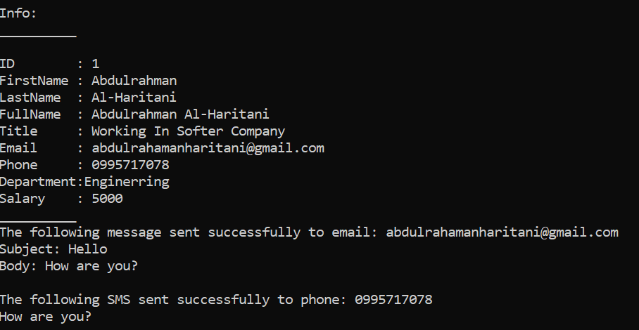

# Employee.cpp

A simple C++ project demonstrating **Encapsulation** using the `Employee` class.

📄 **Source Code**: [Employee/Employee.cpp](Employee/Employee.cpp)

## Class Overview

The `Employee` class represents an employee with the following properties:

| Property    | Access         |
|-------------|----------------|
| ID          | Read Only      |
| FirstName   | Read and Write |
| LastName    | Read and Write |
| FullName    | Read and Write (computed) |
| Title       | Read and Write |
| Email       | Read and Write |
| Phone       | Read and Write |
| Department  | Read and Write |
| Salary      | Read and Write |

## Methods

- `GetID()`
- `SetFirstName()` / `GetFirstName()`
- `SetLastName()` / `GetLastName()`
- `GetFullName()`
- `SetTitle()` / `GetTitle()`
- `SetEmail()` / `GetEmail()`
- `SetPhone()` / `GetPhone()`
- `SetDepartment()` / `GetDepartment()`
- `SetSalary()` / `GetSalary()`
- `SendEmail(Subject, Body)`
- `SendSMS(Message)`
- `Print()`

## Rule

Objects can only be created using the **Constructor**, because all properties are `private`.

## Example Usage

```cpp
Employee Employee1(1, "Abdulrahman", "Al-Haritani",
    "Working In Software Company",
    "abdulrahamanharitani@gmail.com",
    "0995717078", "Engineering", 5000);

Employee1.Print();
Employee1.SendEmail("Hello", "How are you?");
Employee1.SendSMS("How are you?");
```

## Output



## Requirements

Visual Studio 2022 or any C++ compiler supporting C++11 or later.

## Author

Abdulrahman Al-Haritani
